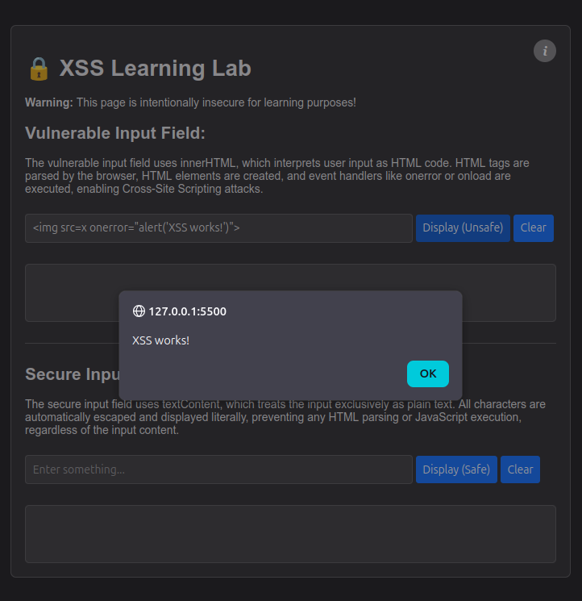
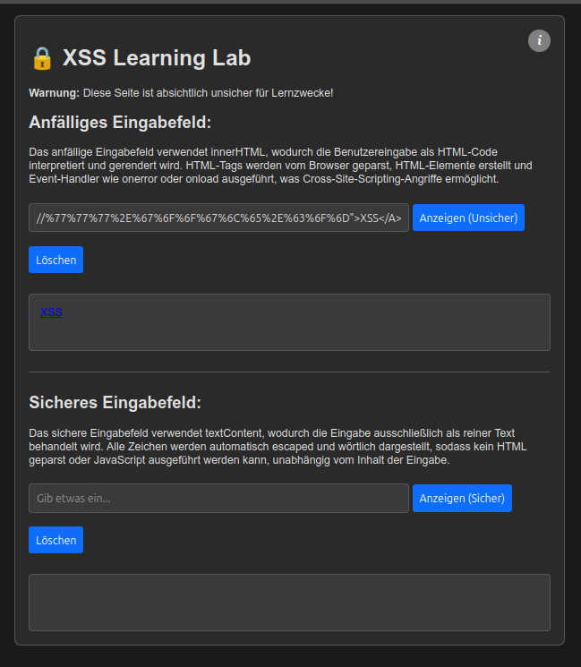

# XSS Test Environment

**[English](#english)** | **[Deutsch](#deutsch)**

---

## English

### Purpose
Educational web application for demonstrating the difference between vulnerable and secure handling of user input in web applications. This project shows how Cross-Site Scripting (XSS) vulnerabilities can occur and how to prevent them.

### Current Features
- **Vulnerable Input Field**: Uses `innerHTML` (intentionally insecure for demonstration)
- **Secure Input Field**: Uses `textContent` (properly secured)
- **Dark/Light Mode**: Theme switcher
- **Language Toggle**: English/German interface
- **Info Modal**: Explanations about the functionality

### Usage
Open `1_basic_html/xss-test.html` in a web browser.

⚠️ **Warning**: This application is intentionally vulnerable and for educational purposes only!

---

## Deutsch

### Zweck
Lernwebanwendung zur Demonstration des Unterschieds zwischen anfälliger und sicherer Verarbeitung von Benutzereingaben in Webanwendungen. Dieses Projekt zeigt, wie Cross-Site Scripting (XSS) Schwachstellen entstehen können und wie man sie verhindert.

### Aktuelle Funktionen
- **Anfälliges Eingabefeld**: Verwendet `innerHTML` (absichtlich unsicher zur Demonstration)
- **Sicheres Eingabefeld**: Verwendet `textContent` (ordnungsgemäß abgesichert)
- **Dark/Light Modus**: Theme-Umschalter
- **Sprachumschaltung**: Englisch/Deutsch Interface
- **Info-Modal**: Erklärungen zur Funktionsweise

### Verwendung
Öffne `1_basic_html/xss-test.html` in einem Webbrowser.

⚠️ **Warnung**: Diese Anwendung ist absichtlich anfällig und nur für Lernzwecke gedacht!
